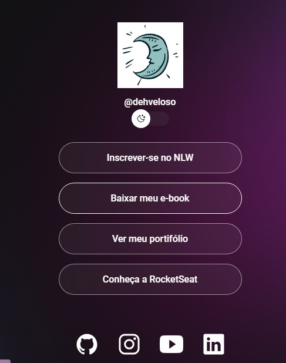

# explore
<h1 align="center">DevLinks</h1>

Programa exclusivo e gratuido, promovido pela Rocketseat para ensino de tecnologias WEB.

<a href="#-tecnologias">Tecnologias</a>&nbsp;&nbsp;&nbsp;|&nbsp;&nbsp;&nbsp;
<a href="#-projeto">Projeto</a>&nbsp;&nbsp;&nbsp;|&nbsp;&nbsp;&nbsp;
<a href="#-layout">Layout</a>&nbsp;&nbsp;&nbsp;|&nbsp;&nbsp;&nbsp;
<a href="#-memo-licença">Licença</a>

 

## 🔥Tecnologias
Esse projeto foi desenvolvido com as seguintes tecnologias:

-HTML e CSS
-JavaScript
-Git e Github
-Figma

## 💻Projeto

O DevLinks é um agregador de links para usar como cartão de visitas online.

## 📝 Layout
Você pode visualizar o layout espelho do projeto através [DESSE LINK](https://www.figma.com/file/MF89TdzM99Fg9Ssu4KyMq/DevLinks-(copy)?node-id=1%3A113&t=8x94o7ecTaQMC2CS-1/duplicate). É necessário ter conta no [Figma](https://figma.com) para acessá-lo.

## :memo: Licença

Esse projeto está sob licença MIT.

---

Feito com ♥ by Aluna Rocketseat :wave: [Participe da comunidade Rocketseat](https://discord.gg/rocketseat)